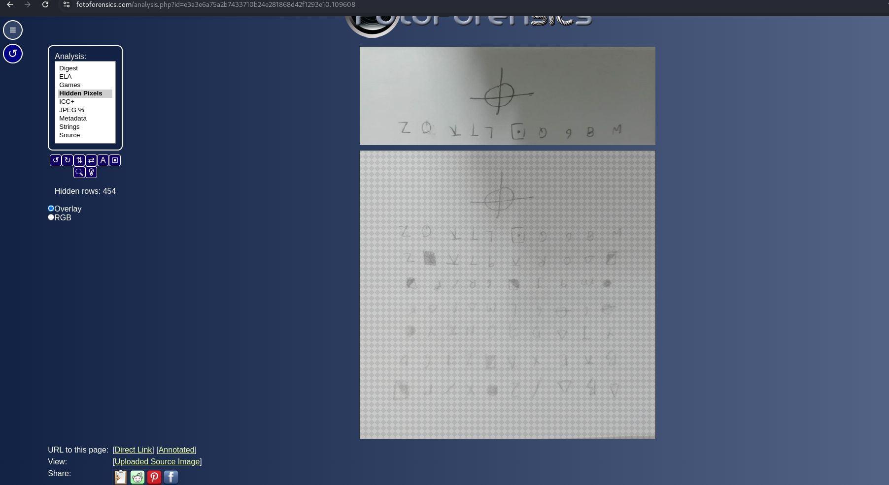
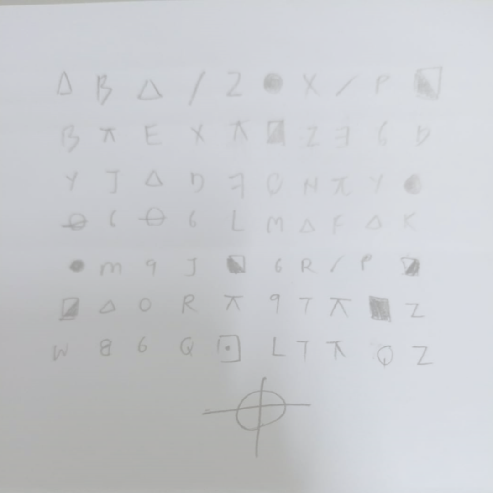
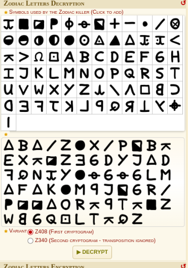

# I'll Kill Yall

The images you were given are not complete. 

Use FotoForensic to unlock the full images.

I used Google Lens to identify what cipher this is; it turns out to be the Zodiac Killer Cipher.

Just enter the characters in the images, choose z403 as the variant, and click on decrypt. 

From the plaintext recovered
> ILIKETOKILLPEOPLECANUFINDMEOUTHAHATHISISTHEFLAGKILLINGPEOPLEEZAFSTOPME

, the real flag is **IBOH{KILLINGPEOPLEEZAF}**.