## 1. Super ssh

enter this command and enter the password when prompted

<code>ssh <username>@titan.ctf.net -p 54184 </code>


## 2. Bookmarklet

bookmarklet are javascript bookmark. bookmarklet are available in all major browser.

to add bookrmarklet write javascript in the url field of the bookmark modal

after adding the bookmark click the bookmark. [read more](https://www.freecodecamp.org/news/what-are-bookmarklets/)

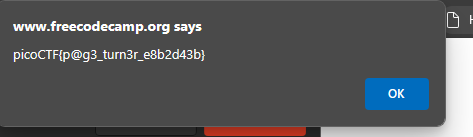


## 3. Commitment Issues

after unzip the file , try list hidden files <code>.git</code>. you'll notice there is message.txt that might look important.

to solve this , learn few things about [git](https://primer.picoctf.org/#_git_version_control).

first we need to loo into check out the commit, somehow the previos commit contain the flag and got removed.
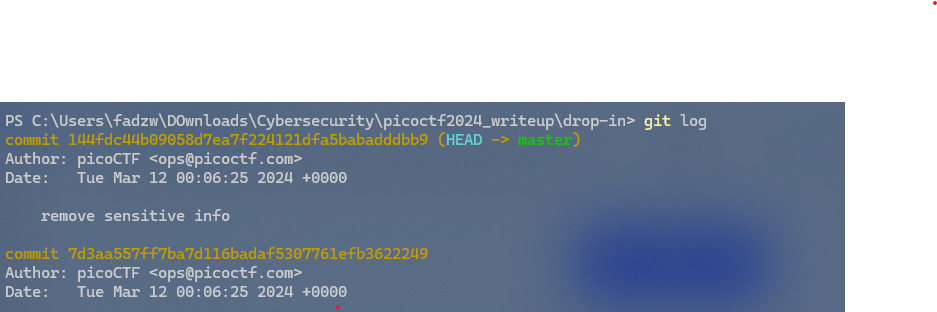

we need to checkout the previous commit
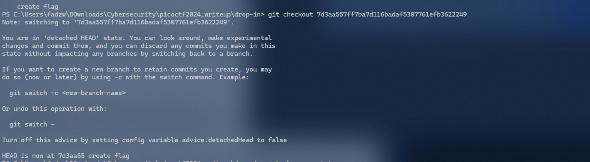

and cat the message
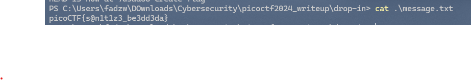

## 4. interencdec

just decode cipher in base64 two times and rot13 with 19 rotation <code>YidkM0JxZGtwQlRYdHFhR3g2YUhsZmF6TnFlVGwzWVROclgyZzBOMm8yYXpZNWZRPT0nCg==</code>

## 5. Time Machine
download the challenge.zip, navigate to drop-in , cat the message and read the clue , enter <code>git log</code> to look into commit history

## 6. Blame Game
its similar to Time Machine nad Commitment Issues , but insteead we want to look into commit history of specific files. You just need to <code>git log message.py</code>, and you will get the flag.
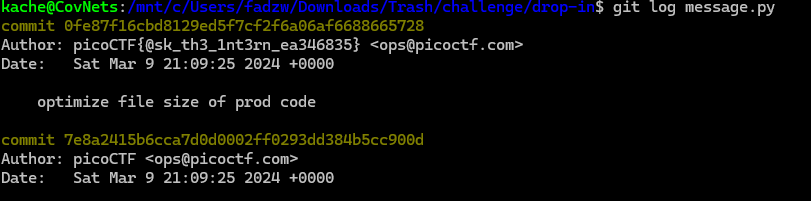

## 7. Collaborative Developmentn
As you can see when we change to other branch , the flag.py contains the some part of the flag.
<code>git checkout feature/part-1 && cat flag.py</code>
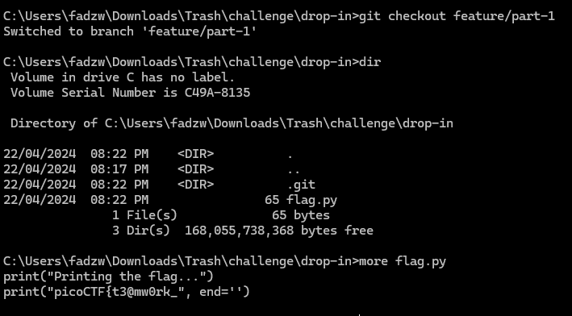

With <code> git branch -a </code> you can see all branch. There are three feature branches and each one has a part of the flag. You can merge them all withou conflicts using command below.

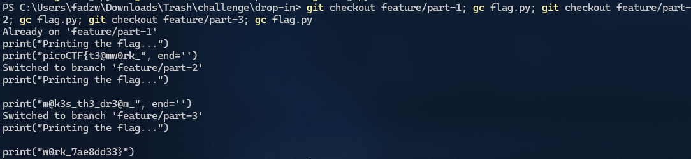

## 8. weirdSnake

this is a re challenge. 
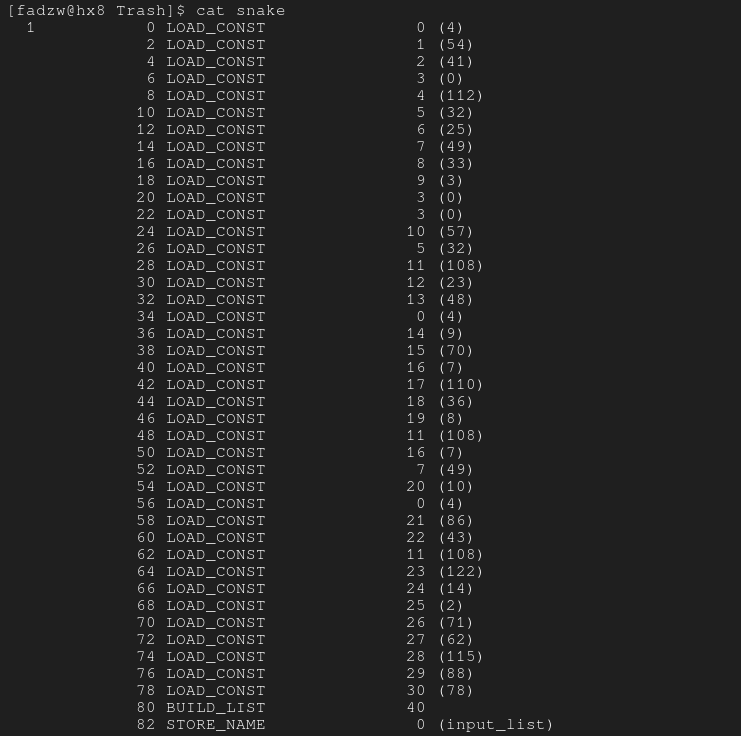

```py
input_list = [4, 54, 41, 0, 112, 32, 25, 49, 33, 3, 0, 0, 57, 32, 108, 23, 48, 4, 9, 70, 7, 110, 36, 8, 108, 7, 49, 10, 4, 86, 43, 108, 112, 14, 2, 71, 62, 115, 88, 78]
```


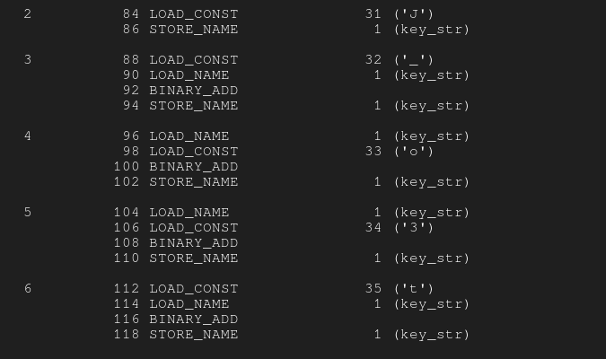
```py
key_str = "J"
key_str = "_" + key_str
key_str = key_str + "o"
key_str = key_str + "3"
key_str = "t" + key_str

```

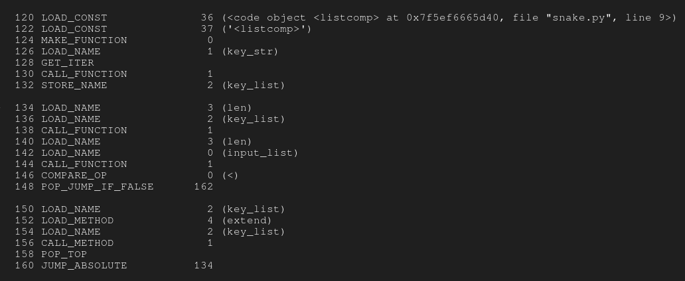
```py
key_list = [ord(char) for char in key_str]
while len(key_list) < len(input_list):
    key_list.extend(key_list)
    print(key_list)

```

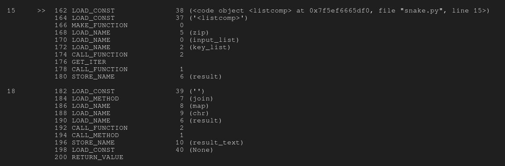
```py
result = [a^b for a,b in zip(input_list, key_list)]
```

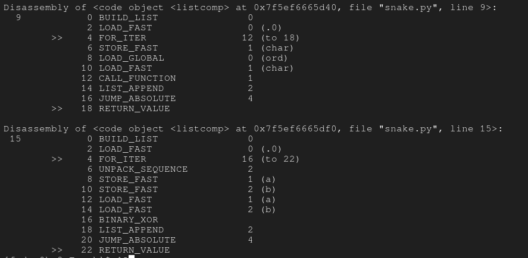


so the final code will be 

```py
input_list = [4, 54, 41, 0, 112, 32, 25, 49, 33, 3, 0, 0, 57, 32, 108, 23, 48, 4, 9, 70, 7, 110, 36, 8, 108, 7, 49, 10, 4, 86, 43, 108, 112, 14, 2, 71, 62, 115, 88, 78]
key_str = "J"
key_str = "_" + key_str
key_str = key_str + "o"
key_str = key_str + "3"
key_str = "t" + key_str
key_list = [ord(char) for char in key_str]
while len(key_list) < len(input_list):
    key_list.extend(key_list)
    print(key_list)
result = [a^b for a,b in zip(input_list, key_list)]
result_text = ''.join(map(chr,result))
print(result_text
```

can refer more [here](https://sudorem.dev/posts/pico24-weirdsnake/)

## 9. Verify

```bash 
ctf-player@pico-chall$ ls
checksum.txt  decrypt.sh  files
```

```bash 
ctf-player@pico-chall$ cd files
ctf-player@pico-chall$ ls
00011a60  63MqIIVV  CLCyTz85  IlQwVZcY	QbiQCWZr  Ww6oTYL8  eZ4ehccg  lxv6mvZ6	sAy34VP4
022cvpdN  64nJlBLv  CNvsyU3W  ItYR0Da2	QcIkjhJ0  X5rRZ32p  efpcZmHN  m1NnTZoo	sKi8TaSn
04nLilRD  69JSHBh1  Cb22Z7FO  Izq2bmb5	QgmCuMSV  XGTpUJIw  ekSs7xW4  m3bsNhyN	sNI2Q6oa
0MT2Wrui  6vgioqew  Ce5TrzJu  J16J63tC	Qxrlj2uk  XJiFKTlc  eknrQKQh  mWWBZCgt	sRaKyq1f
0SGMttmR  76rj6cv7  ClWGbsxu  JVEoV1Bn	R3rVsQa8  XcmGmkwD  fZHEnAvZ  mdFDpW9k	svmptIxV
0fCDySFB  7j2g9w9w  DCn7KnqG  Jcwq4RxP	RAXeLvjl  YAZlvEou  g2E6RkkX  n2XnM9Nc	tFGQywwr
0hHVJSPh  7ye3lPVb  DSKHZ66z  Jk8UBmcS	RFLWtody  YKQLrxBm  g2nu6vlR  n7Vs8Bjh	tY2epsSy
0mPyFlda  870YaC5g  Dmsex2Ug  KCL5hW02	RHjAw3hj  YdTZkUcM  gLAo3J0D  n8r2Ejk9	tuma818A
0xknvebh  8Shyigig  EBBoQm7M  KKRWbrqC	RPVIP1xx  Z2rLXuyp  gem657x8  nldOsSfJ	uMpXxbqr
1kTWMoOI  8d0Ncqme  EG1lW2KR  KUIfl2m7	RQWaIGxG  ZWIiY84t  hNqXyUX2  nnZ33FAt	uUI8gJNi
1mGlW6Ts  8hKIvq38  EXQ6DiO5  KbGMgDus	RVejZvvP  ZXqAvkcE  hZxbAqts  nrwKQbJk	ugeJ5RN3
2JKdkggW  8rIuGenM  F6yHlWpt  KlqDh1ZQ	RdYwRe68  ZdPbKJh1  haNCaZmC  oNnB9jru	vJDrHtxo
2Jr8UtbZ  91cLOGeN  FJBePm2b  L58tTvhF	Rgs7l9CZ  ZyNsHVFW  iGwCDzaU  oi96tAtc	vMv1M1qs
2K4XCmfE  9DNfzhUK  FLsBEmlR  L7gltlCF	ScOtAOiZ  aGVRRt1d  iILvZZya  oiy29oCW	vWguQ8rQ
2MYWkWLC  9KIFXofB  FOxKdaVP  LCLocE1C	SwrcVnay  aHFaEXKf  ih6levXk  p1LgEQdu	vc1wGQhn
2QpRnoZQ  9pluLfgA  FtMorZ65  LMavH6jA	T5IkmqtJ  aIz8E0Iy  j1v0LBVe  p5INCxLV	vjypfsoh
2emuPVOb  ADMuzktV  G7enzzui  Lq3dNalV	T6AHhqdE  afLk75aO  jIlhVDLw  p5INQHq8	vsGKdf0J
2gP5wDgq  AEJxVlNY  Gcv1H8Qs  LrYo1dnu	TPBDRCiJ  b9YCg3Tz  jObn0z94  pXJHJUbH	w1XGgnr9
2w5vJlLG  AGOEyD4N  GhrShrXN  MPeS8YHI	TRyxUwzw  bDK7A26M  jVkxEmtq  pb1E0Y3Z	w8DmFhfg
2yMtx5qd  AVdbk5eX  Gtk4Kn9w  N8vFOGDF	TXsLzqsp  bDZN0f4B  jVlaDg4q  pnycz11G	woaiQu5g
303DzMmf  AXFWLqwI  GufDk3Mb  NC6PZdoL	TeaXjOeh  bcZupFpi  jcMzi4VO  q53EoTzu	wvhWmTPt
33CFCJ0y  AdzCNBlC  HDLWGApz  NS9xPzIA	TeyHF78l  bjtBJwTc  jdYv9CQ3  qCTrc9yM	xQJV5GcG
36tjTWoF  AiUxYmz8  HIeYL84k  Ndyi6bnx	ToT9QPKf  c3Z3JN0m  jzmPaO2D  qHwcKaSC	xlqXOqhL
3KZwXc8s  AmsN0Lkj  HJIPzwjJ  NxdIqu0S	TtPblPd6  cIDWC9cb  kDPV8ASY  qK35XlHM	yACAaKqG
3Vs8v8kW  ArUDDIQ3  HMq6348V  O5tEUFhw	U3BoYTr9  dDoFZTXh  kKVvPy8S  qSn3WAyi	yYRsKiUO
3qDKN57P  Azqf6EEw  HUjCgnh4  OH3906gp	UDI6pN8S  dKYP6pnk  kWjYWiLD  qV83Dmye	yg7uBent
4CwloraZ  B8pBCEvG  HWRVc59e  OIYZeUCB	UF1urDfG  dKisxYdK  kZ6DTcql  qWv24Da7	zYz6howf
4XqPqs6B  BN0HxLxE  Hmr54gXd  OPqDbOIH	UUiDNDlO  deppMJSV  kbumrMcy  qZ7TLGA0	zjkul95p
4k4veVKp  BOeN3lXR  HqxLJgMp  Oe0SOw16	UuC7t9JQ  dv0Mm4vr  knHTEYup  qojIz6XF	zoz7gvVr
4sczhCZl  BdO65Tk4  IDQQR4nq  OnCx4O4u	V2eK2wiC  e1x51vcc  ksIZWNZR  r3HVTaJd
58BnWcOc  Bh5xju3q  IITtRrrR  P7orF8IR	V4VMSZd9  e2umkBxy  lZiPMwX4  r3Pw8pFI
5bSdd2sp  C1kYNpjq  IbMiqCHJ  PECjZnzJ	VhBNGSYV  e5b74XZq  lcYptJNC  r8vIZE1F
5gxjbRbh  CF4c5xR8  Ie0xOcl5  PpktRW9a	WBpZ7iz6  eFlmUkb6  ld12od7V  rzYX4BnS
5rHRNllE  CGkVyMxT  IikIpp05  QHv46Plh	WjY12GNe  eNfM7vPK  lmr9cGCE  s9TOeOaJ
```
you have to hash all files and grep content that is equal with given hash. get to know its file name
```bash
ctf-player@pico-chall$ sha256sum files/* | grep 03b52eabed517324828b9e09cbbf8a7b0911f348f76cf989ba6d51acede6d5d8
03b52eabed517324828b9e09cbbf8a7b0911f348f76cf989ba6d51acede6d5d8  files/00011a60
```

and decrypt with given bash
```bash
ctf-player@pico-chall$ ./decrypt.sh files/00011a60
picoCTF{trust_but_verify_00011a60}
```

## 10. Scan Suprise

start instance and connect through ssh. you will be given qr code, scan that with any tools , i use https://scanqr.org/#scan

```bash
[fadzw@hx8 ~]$ ssh -p 63103 ctf-player@atlas.picoctf.net
The authenticity of host '[atlas.picoctf.net]:63103 ([18.217.83.136]:63103)' can't be established.
ED25519 key fingerprint is SHA256:hVmbk/OaNT4902bBr7h26wfhmBuJWi4tub8AJqoAJCM.
This key is not known by any other names.
Are you sure you want to continue connecting (yes/no/[fingerprint])? yes
Warning: Permanently added '[atlas.picoctf.net]:63103' (ED25519) to the list of known hosts.
ctf-player@atlas.picoctf.net's password: 
```

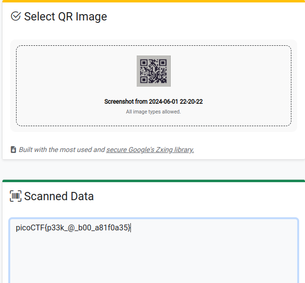


## 11.bithexa

```bash
[fadzw@hx8 ~]$ nc titan.picoctf.net 52628

Welcome to the Binary Challenge!"
Your task is to perform the unique operations in the given order and find the final result in hexadecimal that yields the flag.

Binary Number 1: 01000010
Binary Number 2: 10001000


Question 1/6:
Operation 1: '|'
Perform the operation on Binary Number 1&2.
Enter the binary result: 11001010      
Correct!

Question 2/6:
Operation 2: '&'
Perform the operation on Binary Number 1&2.
Enter the binary result: 00000000
Correct!

Question 3/6:
Operation 3: '+'
Perform the operation on Binary Number 1&2.
Enter the binary result: 11001010
Correct!

Question 4/6:
Operation 4: '>>'
Perform a right shift of Binary Number 2 by 1 bits .
Enter the binary result: 01000100
Correct!

Question 5/6:
Operation 5: '<<'
Perform a left shift of Binary Number 1 by 1 bits.
Enter the binary result: 10000100   
Correct!

Question 6/6:
Operation 6: '*'
Perform the operation on Binary Number 1&2.
Enter the binary result: 10001100010000
Correct!

Enter the results of the last operation in hexadecimal: 0x2310

Correct answer!
The flag is: picoCTF{b1tw^3se_0p3eR@tI0n_su33essFuL_d9a7ddd2}
```
you can do binary operation using python.declare int bin with 0b infront. bin() is to convert int to binary format.
```python
[fadzw@hx8 ~]$ python
Python 3.12.3 (main, Apr 23 2024, 09:16:07) [GCC 13.2.1 20240417] on linux
Type "help", "copyright", "credits" or "license" for more information.
>>> one = 0b01000010
>>> two = 0b10001000
>>> one | two
202
>>> bin(202)
'0b11001010'
>>> bin(one + two)
'0b11001010'
>>> bin(two >> 1)
'0b1000100'
>>> bin(one << 1)
'0b10000100'
>>> bin(one*two)
'0b10001100010000'
>>> hex(one*two)
'0x2310'
```

## 11. CanYouSee

donwload files and analyze image with any exif tools. the atrributeurl in base64 format. simply
```bash
[fadzw@hx8 ctf]$ echo cGljb0NURntNRTc0RDQ3QV9ISUREM05fZDhjMzgxZmR9Cg== | base64 -d
picoCTF{ME74D47A_HIDD3N_d8c381fd}
```

## 12. Binary Search

Im actually dont know the exact method to solve this challenge, but here is how i solve it.<br>
The challenge is named **Binary Search**, keep that in mind. <br>
- As usual, launch the instance and enter the password. <br>
- From that you will be greet with a question to guess the number between 1 to 1000 with only 10 guesses. <br>
- If you apply binary seach in this challenge yourself, you might be able to solve it. <br>

so here how i do it.. 

**the first guess should always be 500.**

- this is to split the guess into half. <br>
- if it lower or higher, then you should always divde the remaining into half and see if it lower or higher. <br>
- by using this method you might be able to solve it rather than simply guess the number. 

congrats, you just did a **binary search** :p

## 13. Unminify

As the name suggest, you are required to inspect the website by launching instance.<br>
and then, go to the **source** and **index**.<br>
You can find the flag is hidden in the body part **between this line of code** ;

```html
  <p class="picoctf{}">If you're reading this, your browser has succesfully received the flag.</p>

  this is where they hide the flag

  <p class="picoctf{}">I just deliver flags, I don't know how to read them...</p>
```

Or simply can curl through
```bash
[eyun@eax ~]$ history | curl -s http://titan.picoctf.net:63495/ | grep -oE picoCTF{.*} --color=none | cut -d "\"" -f1
picoCTF{pr3tty_c0d3_ed938a7e}
```


# 14. Mob psycho

check filetype of said apk, turns out just a zip, unzizp it.

```bash
[eyun@eax picoctf2024]$ file mobpsycho.apk 
mobpsycho.apk: Zip archive data, at least v1.0 to extract, compression method=store
[eyun@eax picoctf2024]$ 7z x mobpsycho.apk 
```

find txt files and cat the its contain
```bash
[eyun@eax picoctf2024]$ find . -name "*.txt"
./res/color/flag.txt
[eyun@eax picoctf2024]$ cat ./res/color/flag.txt
7069636f4354467b6178386d433052553676655f4e5838356c346178386d436c5f37303364643965667d```
```
this is a hex string, convert to string and you'll het your flag.

# 15. FastCheck

if you strings bin | grep pico , you will get half the flag. proceed with ghidra seach pico string and export related function, turns out to be the main function. export this function into c codes.

```c

/* WARNING: Removing unreachable block (ram,0x0010170c) */

undefined8 main(void)

{
  char cVar1;
  char *pcVar2;
  long in_FS_OFFSET;
  allocator<char> local_249;
  basic_string<> local_248 [32];
  basic_string local_228 [32];
  basic_string<> local_208 [32];
  basic_string local_1e8 [32];
  basic_string local_1c8 [32];
  basic_string local_1a8 [32];
  basic_string local_188 [32];
  basic_string local_168 [32];
  basic_string<> local_148 [32];
  basic_string local_128 [32];
  basic_string<> local_108 [32];
  basic_string<> local_e8 [32];
  basic_string local_c8 [32];
  basic_string<> local_a8 [32];
  basic_string local_88 [32];
  basic_string local_68 [32];
  basic_string<> local_48 [40];
  long local_20;
  
  local_20 = *(long *)(in_FS_OFFSET + 0x28);
  std::allocator<char>::allocator();
                    /* try { // try from 001012cf to 001012d3 has its CatchHandler @ 00101975 */
  std::__cxx11::basic_string<>::basic_string
            ((char *)local_248,(allocator *)"picoCTF{wELF_d0N3_mate_");
  std::allocator<char>::~allocator(&local_249);
  std::allocator<char>::allocator();
                    /* try { // try from 0010130a to 0010130e has its CatchHandler @ 00101996 */
  std::__cxx11::basic_string<>::basic_string((char *)local_228,(allocator *)&DAT_0010201d);
  std::allocator<char>::~allocator(&local_249);
  std::allocator<char>::allocator();
                    /* try { // try from 00101345 to 00101349 has its CatchHandler @ 001019b1 */
  std::__cxx11::basic_string<>::basic_string((char *)local_208,(allocator *)&DAT_0010201f);
  std::allocator<char>::~allocator(&local_249);
  std::allocator<char>::allocator();
                    /* try { // try from 00101380 to 00101384 has its CatchHandler @ 001019cc */
  std::__cxx11::basic_string<>::basic_string((char *)local_1e8,(allocator *)&DAT_00102021);
  std::allocator<char>::~allocator(&local_249);
  std::allocator<char>::allocator();
                    /* try { // try from 001013bb to 001013bf has its CatchHandler @ 001019e7 */
  std::__cxx11::basic_string<>::basic_string((char *)local_1c8,(allocator *)&DAT_00102023);
  std::allocator<char>::~allocator(&local_249);
  std::allocator<char>::allocator();
                    /* try { // try from 001013f6 to 001013fa has its CatchHandler @ 00101a02 */
  std::__cxx11::basic_string<>::basic_string((char *)local_1a8,(allocator *)&DAT_00102025);
  std::allocator<char>::~allocator(&local_249);
  std::allocator<char>::allocator();
                    /* try { // try from 00101431 to 00101435 has its CatchHandler @ 00101a1d */
  std::__cxx11::basic_string<>::basic_string((char *)local_188,(allocator *)&DAT_0010201f);
  std::allocator<char>::~allocator(&local_249);
  std::allocator<char>::allocator();
                    /* try { // try from 0010146c to 00101470 has its CatchHandler @ 00101a38 */
  std::__cxx11::basic_string<>::basic_string((char *)local_168,(allocator *)&DAT_00102027);
  std::allocator<char>::~allocator(&local_249);
  std::allocator<char>::allocator();
                    /* try { // try from 001014a7 to 001014ab has its CatchHandler @ 00101a53 */
  std::__cxx11::basic_string<>::basic_string((char *)local_148,(allocator *)&DAT_00102025);
  std::allocator<char>::~allocator(&local_249);
  std::allocator<char>::allocator();
                    /* try { // try from 001014e2 to 001014e6 has its CatchHandler @ 00101a6e */
  std::__cxx11::basic_string<>::basic_string((char *)local_128,(allocator *)&DAT_00102025);
  std::allocator<char>::~allocator(&local_249);
  std::allocator<char>::allocator();
                    /* try { // try from 0010151d to 00101521 has its CatchHandler @ 00101a89 */
  std::__cxx11::basic_string<>::basic_string((char *)local_108,(allocator *)&DAT_00102029);
  std::allocator<char>::~allocator(&local_249);
  std::allocator<char>::allocator();
                    /* try { // try from 00101558 to 0010155c has its CatchHandler @ 00101aa4 */
  std::__cxx11::basic_string<>::basic_string((char *)local_e8,(allocator *)&DAT_0010202b);
  std::allocator<char>::~allocator(&local_249);
  std::allocator<char>::allocator();
                    /* try { // try from 00101593 to 00101597 has its CatchHandler @ 00101abf */
  std::__cxx11::basic_string<>::basic_string((char *)local_c8,(allocator *)&DAT_0010202d);
  std::allocator<char>::~allocator(&local_249);
  std::allocator<char>::allocator();
                    /* try { // try from 001015ce to 001015d2 has its CatchHandler @ 00101ada */
  std::__cxx11::basic_string<>::basic_string((char *)local_a8,(allocator *)&DAT_00102021);
  std::allocator<char>::~allocator(&local_249);
  std::allocator<char>::allocator();
                    /* try { // try from 00101606 to 0010160a has its CatchHandler @ 00101af5 */
  std::__cxx11::basic_string<>::basic_string((char *)local_88,(allocator *)&DAT_00102025);
  std::allocator<char>::~allocator(&local_249);
  std::allocator<char>::allocator();
                    /* try { // try from 0010163e to 00101642 has its CatchHandler @ 00101b0d */
  std::__cxx11::basic_string<>::basic_string((char *)local_68,(allocator *)&DAT_00102029);
  std::allocator<char>::~allocator(&local_249);
  std::allocator<char>::allocator();
                    /* try { // try from 00101676 to 0010167a has its CatchHandler @ 00101b25 */
  std::__cxx11::basic_string<>::basic_string((char *)local_48,(allocator *)&DAT_0010202f);
  std::allocator<char>::~allocator(&local_249);
                    /* try { // try from 00101699 to 0010185f has its CatchHandler @ 00101b3d */
  pcVar2 = (char *)std::__cxx11::basic_string<>::operator[]((ulong)local_208);
  if (*pcVar2 < 'B') {
    std::__cxx11::basic_string<>::operator+=(local_248,local_c8);
  }
  pcVar2 = (char *)std::__cxx11::basic_string<>::operator[]((ulong)local_a8);
  if (*pcVar2 != 'A') {
    std::__cxx11::basic_string<>::operator+=(local_248,local_68);
  }
  pcVar2 = (char *)std::__cxx11::basic_string<>::operator[]((ulong)local_1c8);
  cVar1 = *pcVar2;
  pcVar2 = (char *)std::__cxx11::basic_string<>::operator[]((ulong)local_148);
  if ((int)cVar1 - (int)*pcVar2 == 3) {
    std::__cxx11::basic_string<>::operator+=(local_248,local_1c8);
  }
  std::__cxx11::basic_string<>::operator+=(local_248,local_1e8);
  std::__cxx11::basic_string<>::operator+=(local_248,local_188);
  pcVar2 = (char *)std::__cxx11::basic_string<>::operator[]((ulong)local_168);
  if (*pcVar2 == 'G') {
    std::__cxx11::basic_string<>::operator+=(local_248,local_168);
  }
  std::__cxx11::basic_string<>::operator+=(local_248,local_1a8);
  std::__cxx11::basic_string<>::operator+=(local_248,local_88);
  std::__cxx11::basic_string<>::operator+=(local_248,local_228);
  std::__cxx11::basic_string<>::operator+=(local_248,local_128);
  std::__cxx11::basic_string<>::operator+=(local_248,'}');
  std::__cxx11::basic_string<>::~basic_string(local_48);
  std::__cxx11::basic_string<>::~basic_string((basic_string<> *)local_68);
  std::__cxx11::basic_string<>::~basic_string((basic_string<> *)local_88);
  std::__cxx11::basic_string<>::~basic_string(local_a8);
  std::__cxx11::basic_string<>::~basic_string((basic_string<> *)local_c8);
  std::__cxx11::basic_string<>::~basic_string(local_e8);
  std::__cxx11::basic_string<>::~basic_string(local_108);
  std::__cxx11::basic_string<>::~basic_string((basic_string<> *)local_128);
  std::__cxx11::basic_string<>::~basic_string(local_148);
  std::__cxx11::basic_string<>::~basic_string((basic_string<> *)local_168);
  std::__cxx11::basic_string<>::~basic_string((basic_string<> *)local_188);
  std::__cxx11::basic_string<>::~basic_string((basic_string<> *)local_1a8);
  std::__cxx11::basic_string<>::~basic_string((basic_string<> *)local_1c8);
  std::__cxx11::basic_string<>::~basic_string((basic_string<> *)local_1e8);
  std::__cxx11::basic_string<>::~basic_string(local_208);
  std::__cxx11::basic_string<>::~basic_string((basic_string<> *)local_228);
  std::__cxx11::basic_string<>::~basic_string(local_248);
  if (local_20 == *(long *)(in_FS_OFFSET + 0x28)) {
    return 0;
  }
                    /* WARNING: Subroutine does not return */
  __stack_chk_fail();
}
```

use chatgpt to translate this code into readable c code

```c

<BS>#include <iostream>
#include <string>

int main() {
    std::string local_248 = "picoCTF{wELF_d0N3_mate_";
    std::string local_228 = "}";
    std::string local_208 = "y";
    std::string local_1e8 = "o";
    std::string local_1c8 = "k";
    std::string local_1a8 = "t";
    std::string local_188 = "l";
    std::string local_168 = "G";
    std::string local_148 = "h";
    std::string local_128 = "e";
    std::string local_108 = "a";
    std::string local_e8 = "u";
    std::string local_c8 = "d";
    std::string local_a8 = "n";
    std::string local_88 = "t";
    std::string local_68 = "o";
    std::string local_48 = "m";

    // Equivalent checks and concatenations
    if (local_208[0] < 'B') {
        local_248 += local_c8;
    }
    if (local_a8[0] != 'A') {
        local_248 += local_68;
    }
    if (local_1c8[0] - local_148[0] == 3) {
        local_248 += local_1c8;
    }
    local_248 += local_1e8;
    local_248 += local_188;
    if (local_168[0] == 'G') {
        local_248 += local_168;
    }
    local_248 += local_1a8;
    local_248 += local_88;
    local_248 += local_228;
    local_248 += local_128;
    local_248 += '}';

    std::cout << local_248 << std::endl;

    return 0;
}
```

and now you can find the half ouput.

## format-string  0
honestly i just choose  random and got the flag
```bash
Please choose from the following burgers: Breakf@st_Burger, Gr%114d_Cheese, Bac0n_D3luxe
Enter your recommendation: Gr%114d_Cheese
Gr                                                                                                           4202954_Cheese
Good job! Patrick is happy! Now can you serve the second customer?
Sponge Bob wants something outrageous that would break the shop (better be served quick before the shop owner kicks you out!)
Please choose from the following burgers: Pe%to_Portobello, $outhwest_Burger, Cla%sic_Che%s%steak
Enter your recommendation: Cla%sic_Che%s%steak
ClaCla%sic_Che%s%steakic_Che(null)
picoCTF{7h3_cu570m3r_15_n3v3r_SEGFAULT_dc0f36c4}
```


## formant-string 1

the use of ```printf(buf);``` can lead to a format string vulnerability, where an attacker can exploit this to execute arbitrary code or read from the stack.
were gonna use %p payload to reveal the memory address from the stack , can refer [here](https://ir0nstone.git book.io/notes/types/stack/format-string)

```bash
[eyun@eax ~]$ nc mimas.picoctf.net 53103
Give me your order and I'll read it back to you:
%14$p.%15$p.%16$p.%17$p.%18$p.%22$p.%23$p 
Here's your order: 0x7b4654436f636970.0x355f31346d316e34.0x3478345f33317937.0x35625f673431665f.0x7d663839623764.0x206e693374307250.0xa336c797453
Bye!
```

Then reorder the hex according to LIFO order.
[ref 1](https://github.com/noamgariani11/picoCTF-2024-Writeup/blob/main/Binary%20Explotation/format-string-1.md) , [ref 2](https://medium.com/@mastercode112/picoctf-2024-writeup-by-mastercode-d9eae91698a1)

